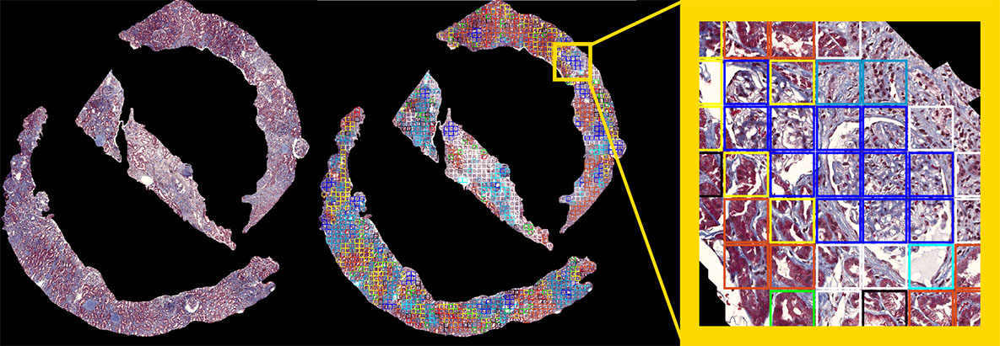

## BoSVW
Unsupervised Machine learning applied to digital histopathology data for Chronic Kidney Disease patients

publication: Unsupervised machine learning for identifying important visual features through Bag-of-Words using histopathology data from Chronic Kidney Disease (revision)



plot Fig 1. (a) cortex part (b) visual color coded map (c) a zoomed image

### Deep learning segmentation
DeepLabV3_for_BoSVW

Deep Lab V3+: Semantic Segmentation Deep Learning model
Article: Encoder-Decoder with Atrous Separable Convolution for Semantic Image Segmentation (Chen et al.)

### Stain Normalization
https://github.com/aznetz/Stain_Normalization

### Visualization
1. copy "clusterMap.m" and "Feature_57_visual_patches_20th.mat" files to a folder in your PC.
2. contents in Feature_57_visual_patches_20th.mat
```
IMG: image
KM0_clust_idx: cluster index
Mask: corresponding mask
LineWidth: default is 5
n_th: case number
overlap: default is 0
patient_idx: patient index
```
3. Run MATLAB
4. Go to the folder that contains these files in MATLAB.
5. Load Feature_Feature_57_visual_patches_20th.mat and type following in the command window:
```
clusterMap(IMG, KM0_clust_idx, Mask, patient_idx, n_th, overlap, 1, 999)
```

6. if you want to change the line width of the patch color, change 1 -> 5
```
clusterMap(IMG, KM0_clust_idx, Mask, patient_idx, n_th, overlap, 5, 999)
```
